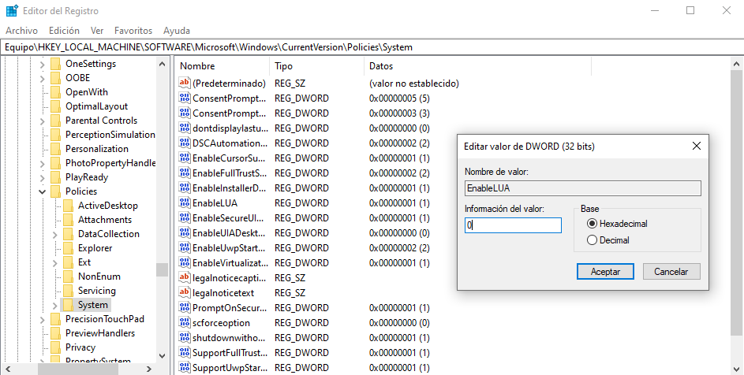

# debian

- `apt-cache showpkg <package>` para mostrar información de un paquete.
- `apt-file search /usr/bin/<command>` para mostrar a que paquete pertenece un
comando.
- `apt list --installed` para mostrar los paquetes instalados.
- `apt list --installed | grep <package>` para buscar un paquete descargado.
- `apt list --upgradable` para mostrar paquetes disponibles para actualizar.
- `cal` o `ncal` para ver un calendario o la fecha actual.
- `cat /etc/shells` para ver las terminales disponibles.
- `date` para ver la fecha y hora.
- `df -h` muestra particiones, su tamaño y el espacio usado y disponible.
- `dpkg-query -W <package>` para mostrar la versión de un paquete instalado.
- `dpkg -S $(which <command>)` o `dpkg -S /usr/bin/<command>` para conocer a que
paquete pertenece un comando.
- `echo $SHELL`, `echo $0` o `echo $TERM` para ver el tipo de terminal.
- `echo <password> | sudo -S <comando>` para ejecutar un comando con permisos de
administrador
- `echo <password> | sudo -u <user_name> -S <comando>` para ejecutar un comando
como el usuario indicado.
- `echo <msg> > /dev/pts/<n>` para mostrar un mensaje en la terminal `<n>`.
- `eject <device>` para ejecutar un disco.
- `exiftool [-|h|v] <filename>` para ver los metadatos de un archivo.
- `exiftool -tag="<label>"` para agregar un tag o metadato al archivo.
- `find . -maxdepth=1 -type f | wc -l` para contar el número de archivos en el
directorio actual.
- `find -name '*.<ext>' -type f` para listar archivos con cierta extensión.
- `find -name '*.<ext>' -type f -delete` para eliminar archivos con cierta extensión.
- `find -type f -print0 | xargs -0 -I % md5sum % | tee <file>` para crear un archivo
checksum con md5.
- `getent passwd <username>` y `getent group <username>` muestran información del usuario.
- `groups` muestra los grupos del sistema.
- `ln -s <origin_absolute_path> <destination_absolute_path>` para crear un enlace
simbolico a un archivo.
- `ls | wc -l` para contar el número de archivos en un directorio.
- `ls -d */` o `ls -F | grep /` para listar los directorios.
- `ls -l /dev/disk/by-uuid` o `ls -l /dev/disk/by-label` para listar los discos conectados.
- `lsblk` muestra los discos, sus particiones, tamaño y el tipo de sistema de archivos.
- `lscpu` para tener información del equipo.
- `lsmem` para tener información de la memoria.
- `mount <device> <mountpoint>` para montar un disco conectado.
- `mount -o gid=<gid>,uid=<uid> <device> <mountpoint>` para montar un dispositivo con
permisos para el grupo y usuario asignado.
- `readlink -f <file_name>` para mostrar el valor de un enlace simbolico.
- `sudo dmidecode` para tener información del sistema.
- `sudo fdisk -l` para listar los discos disponibles.
- `sudo mkdosfs -F 32 -I /dev/sdx -n <unitName>` formatea la unidad indicada y le da
el nombre `<unitName>`.
- `sudo mkfs.<type> -I /dev/sdx -n <unitName>` formatea la unidad indicada con el tipo
de sistema de archivos `<type>` y le asigna el nombre `<unitName>`.
- `sudo service --status-all` para listar los servicios que se están ejecutando.
- `sudo systemctl disable <service_name>` para deshabilitar un servicio.
- `sudo systemctl enable <service_name>` para habilitar un servicio.
- `sudo systemctl list-unit-files --type service --all` para mostrar todos los servicios.
- `sudo systemctl | grep running` para ver los servicios que se están corriendo.
- `sudo ufw allow 1714:1764/tcp` y `sudo ufw allow 1714:1764/udp` para habilitar los
puertos usados por KDE connect.
- `timedatectl` para ver la configuracion de fecha y hora y el servicio NTP.
- `tty` para ver el numero de terminal actual.
- `umount <mountpoint>` para desmontar un disco.
- `uname -a` para tener información del sistema.
- `users` muestra los usuarios del sistema.
- `whoami` muestra el usuario actual y `who` muestra información del usuario.
- `xev` para ver el valor de las teclas en el teclado.

## ports

### Puertos más usados:

- 21: ftp
- 22: ssh
- 23: telnet
- 25: smtp
- 53: dns
- 80: http
- 2049: nfs
- 5900: vnc

### Puertos permitidos por ufw

- 21: ftp
- 22: ssh
- 25: smtp
- 80: http
- 1714-1764: kdeconnect
    - 1716
    - 1739
- 2049: nfs
- 5900: vnc
- 7236: gnome-network-displays
- 8080: python
- 8888: python
- 9999: python

## multimedia

- `convert -resize n% <filename>.<extension>` para generar una copia redimensionada de
una imagen.
- `ffmpeg -i image.jpg -vf scale=256:-1 image.ico` para generar un archivo .ico desde
cualquier tipo de imagen.
- `ffmpeg -i inputVideo.mkv -map 0:x -acodec copy -vcodec copy outputVideo.mp4` para
extraer el video de un archivo mkv.
- `ffmpeg -i inputVideo.* -vf scale=iw*0.0:ih*0.0 outputVideo.*` para ajustar las
dimensiones de un video.
- `ffmpeg -i audio.mp3 -i imagen.jpg -map 0 -map 1 audioImagen.mp3` para agregar una
imagen a un audio.
- `ffmpeg -i audio.mp3 -metadata artist='<artist>' outAudio.mp3` para agregar el
metadato 'artist' a un archivo de audio.
- `ffmpeg -i audio.mp3 -metadata title='<title>' outAudio.mp3` para agregar el metadato
'title' a un archivo de audio.
- `ffmpeg -i audio.mp3 -metadata album='<album>' outAudio.mp3` para agregar el metadato
'album' a un archivo de audio.
- `ffmpeg -i audio.mp3 -metadata genre='<genre>' outAudio.mp3` para agregar el metadato
'genre' a un archivo de audio.
- `img2txt` para mostrar una imagen con caracteres ASCII.
- `mogrify -resize n% <filename>.<extension>` para redimensionar una imagen.
- `yt-dlp -F <URL>` para ver los formatos disponibles de descarga de un video de YouTube.
- `yt-dlp -f 140/139 <URL> -o <fileName>` para descargar un video de YouTube con formato de
audio.
- `yt-dlp -f 22 <URL>` para descargar un video de YouTube con formato de video.

## network

- `ip addr show <iface>` para mostrar informacion de una interfaz de red.
- `ip neigh` mustra los dispositivos vecinos.
- `sudo ip addr add <ip_address>/<netmask> broadcast <broadcast> scope global noprefixroute dev <iface>` para
agregar una ip a una interfaz de red.
- `sudo ip addr del <ip_address>/<netmask> dev <iface>` para eliminar la ip de una interfaz.
- `sudo ip link set <iface> up` para activar una interfaz de red.
- `sudo ip link set <iface> down` para desactivar una interfaz de red.
- `sudo ifconfig <iface> <ip_address> netmask <netmask> broadcast <broadcast>` para agregar una direccion ip
a una interfaz de red.
    - `sudo ifconfig wlan0 192.168.1.64 netmask 255.255.255.0 broadcast 192.168.1.255` como ejemplo.
    - `sudo ifconfig eth1 192.168.4.4` para configurar una ip en una interfaz ethernet.
- `sudo route add default gw <gateway> <iface>` para cambiar la puerta de enlace.
    - `sudo route add default gw 192.168.1.1 wlan0` como ejemplo.
- `sudo dhclient -r` para liberar la direccion ip actual.
- `sudo dhclient` para renovar una direccion ip.
- `sudo networking restart` para reiniciar el servicio de red.
- `curl ifconfig.me` o `ifconfig.me/all` para tener información pública del equipo.
- `hostname -f|i|a` para conocer el información de nuestro host.
- `ifconfig` o `ip a` para ver información de red del equipo.
- `iwconfig` para ver información de la red a la que estamos conectados.
- `iwgetid` para conocer el essid de la red a la que estamos conectados.
- `iwlist` para ver información de la red.
- `nmcli dev wifi` para ver una lista de redes wifi disponibles.
- `nmcli -f ALL dev wifi` para ver una lista más detallada de las redes disponibles.
- `nmcli -m multiline -f ALL dev wifi` muestra información de las redes disponibles en
un formato multilinea.
- `ping <IP>` para realizar una solicitud ICMP a un host.
- `route -n` muestra información de las tablas de enrutamiento de IP.
- `ss -4` para mostrar solo los sockets de versión IPv4.
- `sudo netstat -plnt` para mostrar los puertos abiertos.
- `sudo ufw enable` habilita el firewall `ufw` de linux.
- `sudo ufw disable` deshabilita el firewall `ufw` de linux.
- `sudo ufw reset` para reiniciar el firewall.
- `sudo ufw allow <port>/[tcp/udp]` permite conexiones desde el puerto `<port>`.
- `sudo ufw allow <port1>:<port2>/[tcp/udp]` permite conexiones en un rango de
puertos.
- `sudo ufw allow from <ip_address>` permite la conexion desde la ip `<ip_address>`.
- `sudo ufw allow from <ip_address> to any port <port>/[tcp/udp]` para permitir
la conexion de una ip especifica a un puerto especifico.
- `sudo ufw allow from <prefix>/<netmask>` para permitir acceso a una subred.
- `sudo ufw allow in on <net_iface>` para permitir conexiones desde una interfaz de
red especifica.
- `sudo ufw deny <port>/[tcp/udp]` niega conexiones desde el puerto `<port>`.
- `sudo ufw deny <port1>:<port2>/[tcp/udp]` niega conexiones en un rango de puertos.
- `sudo ufw deny from <ip_address>` niega la conexion desde la ip `<ip_address>`.
- `sudo ufw deny from <ip_address> to any port <port>/[tcp/udp]` para negar
la conexion de una ip especifica a un puerto especifico.
- `sudo ufw deny from <prefix>/<netmask>` para negar acceso a una subred.
- `sudo ufw deny in on <net_iface>` para negar conexiones desde una interfaz de
red especifica.
- `sudo ufw delete` elimina una regla aplicada a un puerto.
- `sudo ufw status` muestra el estado del firewall y sus reglas.
- `sudo ufw status numbered` muestra las reglas enumeradas del firewall.
- `sudo udw status verbose` para ver el estado del firewall.
- `sudo ufw default [allow/deny] [incoming/outgoing]` para permitir o denegar las
conexiones de entrada o salida.

Ubicaciones para configurar interfaces de red:

- `/etc/network/interfaces`
- `/etc/netplan/`
- `/etc/NetworkManager/system-connections`

## users

- `useradd` para crear un nuevo usuario.
- `usermod` para modificar un usuario.
- `userdel` para eliminar un usuario.
- `groupadd` para crear un nuevo grupo.
- `groupmod` para modificar un grupo.
- `groupdel` para eliminar un grupo.
- `chown <user>:<group> <files>` para cambiar el propietario de un archivo.
- `chmod` para cambiar los permisos de un archivo o directorio.
- `chgrp` para cambiar el grupo propiertario de un archivo.
- `useradd -m -d /home/<username> -s /bin/<shelltype> <username>` para crear un
usuario con el `<shelltype>` y asignar el directorio `/home/<username>` al usuario.
deseado y su estructura de directorios.
- `passwd <username>` para generar una contraseña para el usuario `<username>`.
- `usermod -aG sudoers <username>` para agregar un usuario al grupo de `sudoers`.
- `usermod -d <dirname> <username>` para asignar el directorio `<dirname>` al usuario
`<username>`.
- `echo $USER` para ver el nombre de usuario.
- `groups <username>` para ver los grupos a los que pertenece el usuario `<username>`.
- `id` para mostrar el id y nombre de los grupos a los que pertenece el usuario.
- `id -Gn <username>` para ver los grupos a los que pertenece el usuario `<username>`.
- `w` para ver lo que hacen los usuarios.
- `whoami` para ver el nombre de usuario.
- `cut -d: -f1 /etc/passwd` para ver todos los usuarios.

## paths

- Configuración de variables de entorno y sistema `~/.zshrc`.
- Configuración de ***ssh*** `~/.ssh/`
- Configuración de ***vim*** `~/.vimrc`.
- Lanzar archivos en el arranque `~/.config/autostart/`.
- Configuración de interfaces de red `/etc/network/interfaces`.
- Configuración de ***apt*** `/etc/apt/`.
- Configuración de redes Wi-Fi `/etc/NetworkManager/system-connections/`.
- Configuración de ***lightdm*** `/etc/lightdm/`.
- Configuración de ***SAMBA*** `/etc/samba/smb.conf`.
- Lanzadores `/usr/share/applications/`.
- Diseño de sistema e iconos `/usr/share/icons`.
- Hosts registrados en el dispositivo `/etc/hosts`.
- Brillo de pantalla `/sys/class/backlight/intel_backlight/`.
- Datos guardados de ***PPSSPP*** `~/.var/app/org.ppsspp.PPSSPP/config/ppsspp/PSP/SAVEDATA/`.
- Archivos necesarios para ***xemu*** `~/.var/app/app.xemu.xemu/data/xemu/xemu/`.
- Para variables de entorno `/etc/profile`, `/etc/environment` y `/etc/environment.d/`.

# opensuse

- `zypper update` para actualizar el sistema.
- `zypper search --intalled-only` para mostrar los paquetes instalados.
- `zypper install iputils` para instalar herramientas de red.
- `zypper install net-tools-deprecated` para instalar herramientas de red.
- `zypper install gcc-g++` para instalar el compilador g++.
- `zypper install go` para instalar golang.

## Creando usuario con sudo habilitado

1. `zypper install sudo`.
2. `zypper install system-group-wheel`.
3. `zypper install system-user-mail`.
4. `useradd -m -d /home/<username> -s /usr/bin/<shell>`.
5. `passwd <username>`.
6. `usermod -aG wheel <username>`.
7. Agregar `%wheel ALL=(ALL:ALL) ALL` a `/etc/sudoers`.

# windows

## UAC

Para deshabilitar el control de cuentas de usuarios se tiene que cambiar el valor de
`EnableLUA` a 0.



## activate windows

Para quitar la marca de agua sobre la activación de `Windows` se cambia el
siguiente valor desde el editor del registro


## Autologin

Para activar el autologin en windows primero se tiene que asignar el valor de
`DevicePasswordLessBuildVersion` a 0


Después, se ejecuta el comando `netplwiz` para terminar de activar el inicio de
sesión automático


Se desmarca el checkbox con la opción
**Los usuarios deben escribir su nombre y contraseña para usar el equipo**
al presionar **Aplicar** se abre una nueva ventana en la que se tienen que
ingresar las credenciales del usuario con el que se quiere iniciar sesión
automáticamente


al pulsar **Aceptar** y cerrar las ventanas, se iniciará la sesión del usuario
automáticamente al reiniciar o en la próxima vez que se encienda el equipo.

# MySQL

## XAMPP

- `sudo /opt/lampp/lampp startmysql` para iniciar el servidor MySQL.
- `/opt/lampp/bin/mysql -u root -p` para iniciar MySQL como root.

## MariaDB

- `sudo apt install mariadb-server` para instalar el servidor y servicio de MariaDB
- `sudo mysql` luego de instalar MariaDB para entrar a mysql como root y configurar
o crear nuevos usuarios, bases de datos y tablas.
- `GRANT ALL ON *.* TO '<user_name>'@'<host_address>' IDENTIFIED BY '<password>'
WITH GRANT OPTION;` para crear un usuario con todos los permisos a tablas y bases de
datos
- `FLUSH PRIVILEGES;` luego de crear un nuevo usuario para refrescar la tabla y que
los cambios tomen efecto.
- `mysql -u <user_name> -p` para ingresar como un usuario especifico.
- `mysql -h <host_address> -u <user_name> -p` para ingresar como un usuario especifico
a un servidor remoto.

### Configurar conexión remota a la base de datos

1. En el servidor, buscar el archivo `/etc/mysql/mysql.conf.d/mysqld.cnf` o
`/etc/mysql/mariadb.conf.d/50-server.cnf` o buscar la cadena `bind-address` en el
directorio `/etc/mysql/` y cambiar el valor de `bind-address` de `127.0.0.1` a
`0.0.0.0`.
2. Reiniciar el servicio de `mysql` o `mariadb`.
3. Habilitar el puerto de ***MySQL*** en el firewall `ufw` con el comando
`sudo ufw allow from <ip_address> to any port 3306` o `sudo ufw allow 3306` (Esto en
caso de tener el firewall instalado y activado).

# jar

```
javac -d . main.java
MANIFEST.MF --> Main-Class: main
jar -cvmf MANIFEST.MF main.jar main.class
java -jar main.jar
```

# vim

- `h` para moverse a la izquierda.
- `j` para moverse hacia abajo.
- `k` para moverse hacia arriba.
- `l` para moverse hacia la derecha.
- `Ctrl+w+h` o `Ctrl+h` para cambiar al panel izquierdo.
- `Ctrl+w+j` o `Ctrl+j` para cambiar al panel de abajo.
- `Ctrl+w+k` o `Ctrl+k` para cambiar al panel de arriba.
- `Ctrl+w+l` o `Ctrl+l` para cambiar al panel derecho.
- `Ctrl+e` para bajar linea por linea sin mover el cursor de posición.
- `Ctrl+d` para bajar media pantalla.
- `Ctrl+y` para subir linea por linea sin mover el cursor de posición.
- `Ctrl+u` para subir media pantalla.
- `Shift+$` para mover el cursor al final de la linea.
- `Shift+^` para mover el cursor al inicio de la linea.
- `v` para activar el modo ***Visual***.
- `Ctrl+o` en modo ***insertar*** para pasar puntualmente al modo ***visual***.
- `Ctrl+v` para activar el modo ***Bloque Visual***.
- `i` para activar el modo ***Insertar***.
- `a` para avanzar un caracter e insertar.
- `Shift+a` para insertar al final de la linea.
- `o` para insertar debajo de la linea.
- `O` para insertar arriba de la linea.
- `Shift+i`, en modo ***Bloque Visual*** inserta en todas las lineas seleccionadas.
- `dd` para cortar la linea o el texto seleccionado.
- `#dd` para cortar # lineas desde el cursor hacia abajo.
- `diw` cortar la palabra actual.
- `yy` para copiar la linea o el texto seleccionado.
- `#yy` para copiar # lineas desde el cursor hacia abajo.
- `yiw` para copiar la palabra actual.
- `u` para deshacer los cambios.
- `:w` para guardar los cambios.
- `:q` para cerrar el editor.
- `:q!` para cerrar el editor sin guardar los cambios.
- `:e` para actualizar el archivo.
- `/` para buscar coincidencias en el archivo de arriba a abajo.
- `?` para buscar coincidencias en el archivo de abajo a arriba.
- `*` al estar situado en una palabra para buscar sus coincidencias.
- `n` al buscar regex's para moverse a la siguiente.
- `N` al buscar regex's para moverse a la anterior.
- `f<c>` o `t<c>` para moverse al siguiente caracter `<c>` en la linea actual.
- `F<c>` o `T<c>` para moverse al caracter anterior `<c>` en la linea actual.
- `Ctrl+w+s`, `:split` o `:sp` para dividir horizontalmente la pantalla.
- `Ctrl+w+v`, `:vsplit` o `:vsp` para dividir verticalmente la pantalla.
- `:tabe` para abrir una nueva pestaña con un archivo o un buffer vacío.
- `gt` para moverse a la pestaña siguiente.
- `gT` para moverse a la pestaña anterior.

## foldmethod

Con `foldmethod=manual`

- `zfj` para plegar dos lineas en una sola.
- `zo` para abrir el plegado.
- `zc` para cerrar el plegado.
- `za` para alternar el estado del plegado.
- `zfip` para plegar el parrafo en el que se encuentra el cursor.
- `zfG` para plegar de la posicion actual al final del archivo.
- `zfa{` para plegar los textos entre llaves `{}`.
- En el modo visual, se selecciona el texto que se quiere plegar y se usa `zf`.
- `:,+1fold` tambien sirve para plegar dos lineas en una, `+1` es el rango de plegado.
- `:n1,n2fold` para plegar de la linea `n1` a la linea `n2`.
- `zR` para abrir todos los plegados.
- `zM` para cerrar todos los plegados.
- `:h fold-commands` para ver la ayuda.

## substitute

Sintaxis para reemplazar en ***vim***:

```
:rango s/patron/reemplazo/[cgil]
```

El rango puede ser:
- `<n>` numero de linea en donde se reemplazara.
- `<n1>,<n2>` rango de lineas a reemplazar.
- `.` para reemplazar en la linea actual.
- `$` para reemplazar en la ultima linea del archivo.
- `%` para reemplazar en todo el archivo.

Las opciones `[cgil]` se refieren a:

- `c` te obliga a confirmar en cada una de las sustituciones.
- `g` reemplaza todas las ocurrencias de la línea. Si no se añade esta opción
solo cambiará la primera de las apariciones en la línea.
- `i` no distingue entre mayúsculas y minúsculas.
- `l` diferencia entre mayúsculas y minúsculas.

Asi, la sintaxis mas comun es:

```
:%s/patron/reemplazo/g
```

Ejemplos de sustituciones:

- `:%s/print\s*.*$/print(\1)` le pone paréntesis a todos los print
- `:%s/^#([A-Fa-f0-9]{6}|[A-Fa-f0-9]{3})$//g` elimina colores en hexadecimal
- `:%s/^(?:[0-9a-f]{2}[\-:]?){6}(?<![\-:])$//g` elimina las direcciones MAC
- `:%s/<!\[CDATA\[(.*)\]\]>//g` eliminar etiquetas `CDATA`

# tmux

- `tmux ls` para listar las sesiones.
- `tmux a -t <session>` para entrar en la sesión \<session\>.
- `tmux new` para crear una sesion con nombre predeterminado.
- `tmux new -s <session>` para crear una nueva sesión con el nombre \<session\>.
- `tmux kill-session -t <session>` para matar una sesión de tmux.
- `tmux kill-session -aC` para matar todas las sesions de tmux.
- `tmux rename-session -t <old_session_name> <new_session_name>` para renombrar la sesión.

Dentro de una sesión usando el prefijo `Ctrl+b`:

- `"` para dividir el panel en 2, arriba y abajo.
- `$` para renombrar la sesión actual.
- `%` para dividir el panel en 2, izquierda y derecha.
- `q` para listar brevemente el indice de los paneles.
- `x` para matar el panel actual.
- `c` para crear una nueva ventana.
- `,` para renombrar la ventana actual.
- `n` para cambiar a la ventana siguiente.
- `p` para cambiar a la ventana anterior.
- `w` para seleccionar una ventana interactivamente.
- `.` para cambiar el indice de la ventana actual.
- `0 to 9` seleccionar una ventana del 0 al 9.
- `&` para matar la ventana actual.
- `(` para cambiar a la sesión previa.
- `)` para cambiar a la sesión siguiente.
- `?` para listar todos los atajos de teclas.
- `D` para elegir un cliente a desplegar.
- `d` para desplegar el cliente actual (salir de la sesión).
- `i` para mostrar información de la ventana actual.
- `s` para seleccionar una nueva sesión del cliente actual de forma interactiva.
- `t` para mostrar la hora.
- `[` para entrar en modo de copiado o moverse por la terminal.

# git

- `git config --global user.name <username>` configura el nombre de usuario.
- `git config --global user.email <email>` configura el email de usuario.
- `git config --global core.editor <editor>` configura el editor por defecto.
- `git config --global alias.<alias> '<command>'` configura los alias usados por git.
- `git config --global init.defaultBranch <name` configura el nombre por default de la
rama.
- `git config --global --edit` para editar el archivo de configuración de git.
- `git config --list --show-origin` muestra informacion de la configuracion, si se
encuentra en un respositorio, muestra informacion del repo.
- `git init` para iniciar un respositorio local.
- `git status` muestra el estado del repositorio.
- `git status -s` muestra una versión corta del estado del repo.
- `git status -bs` muestra la rama y el seguimiento de esta.
- `git add <filename>` agrega al repo el archivo `<filename>` para agregarlo a un commit.
- `git commit` para hacer un nuevo commit.
- `git commit -m "<commit>"` se hace un nuevo commit sin abrir el editor por defecto.
- `git commit -a -m "<commit>"` para agregar todos los cambios y crea el nuevo commit.
- `git commit --amend` agrega los cambios al último commit creado, esto sin crear uno
nuevo, esto sirve para agregar cambios pequeños sin necesidad de agregarlos a un nuevo
commit.
- `git branch` muestra todas las ramas del repo.
- `git branch -a` muestra todas las ramas del repo, incluyendo las remotas.
- `git branch <branchname>` crea una nueva rama.
- `git branch -d <branchname>` elimina una rama.
- `git branch -D <branchname>` fuerza la eliminación de una rama.
- `git branch -v` muestra el nombre de rama, su hash y su commit.
- `git checkout <commithash/branchname>` para moverse a un commit o rama.
- `git checkout -b <branchname>` crea la rama `<branchname>` y se mueve a esta.
- `git log` muestra los commits realizados a detalle.
- `git log -p` muestra los commits realizados y los cambios en el código.
- `git log --oneline` muestra los commits en una sola línea.
- `git log --oneline --graph` muestra los commits de forma gráfica.
- `git log --follow <filename>` hace el seguimiento de un archivo a través de los cambios
del repo.
- `git log --follow -- <filename>` hace el seguimiento de un archivo aunque este fuera
del área de trabajo o eliminado.
- `git diff <commithash> -- <path>` devuelve la diferencia que hay entre el `<path>` en
un commit.
- `git diff <commithash1>..<commithash2> -- <path>` devuelve la diferencia que hay con el
`<path>` entre el `<commit1>` y el `<commit2>`.
- `git diff HEAD~# -- <path>` devuelve la diferencia que hay en el `<path>` entre el
commit que se encuentra # commits detras de `HEAD` y el commit actual.
- `git merge <branchname>` mezcla la rama `<branchname>` con la rama actual.
- `git revert <commithash>` corrige un error en algún commit y corrige los cambios en el
código.
- `git reset [--hard|--soft] <commithash>` regresa el repo al commit deseado.
- `git clone <url>` clona un repositorio remoto.
- `git clone <url> --branch <branchname> --single-branch` clona unicamente la rama
deseada con el nombre `<branchname>`.
- `git pull` actualiza el repositorio local si es que el remoto fue modificado.
- `git remote remove origin` elimina la *url* a la que apunta *origin*.
- `git push origin <branchname>` sube al repositorio remoto la rama `<branchname>` o
actualiza los cambios en este.
- `git push -f origin` fuerza los cambios en el repositorio remoto.
- `git worktree add <path> <branch>` para crear un nuevo arbol de trabajo.
- `git worktree list` para listar los arboles de trabajo actuales.
- `git worktree prune` para eliminar los arboles de trabajo que ya no son necesarios o
que ya no existen.
- `git worktree remove` para eliminar un arbol de trabajo.
- `git archive --format tar --output <file_name>.tar <branch_name>` para crear un
archivador de una rama.
- `git stash` (investigar sobre el comando).

## Subiendo un repositorio local

1. `git init`
2. `git add <list_of_files>`
3. `git commit -m "<first commit>"`
4. `git branch -M main`
5. `git remote add origin <url>`
6. `git push -u origin main`

## Sugerencias para crear commits

`<commit_type>[scope]: <description>`

`<commit_type>`

- `feat`: Una nueva caracteristica para el usuario
- `fix`: Arreglo un bug que afecta al usuario
- `perf`: Cambios que mejoran el rendimiento del sitio
- `build`: Cambios en el sistema de build, tareas de despliegue o instalación
- `ci`: Cambios en la integración continua
- `docs`: Cambios en la documentación
- `refactor`: Refactorización del código como cambios de nombre de variables o funciones.
- `style`: Cambios de formato, tabulaciones, espacios o puntos y coma, etc; no afectan al usuario
- `test`: Añade tests o refactoriza uno existente

### `<scope>`

En monorespositorios multipaquete, se puede añadir tambíen la información
del paquete que es afectado por el commit. Se le conoce como 'scope':

- `feat(backend)`: Descripción del commit.
- `fix(web)`: Descripción del commit.

## Creando un repositorio remoto en un servidor local

1. `useradd -m -s /bin/bash git`
2. `sudo passwd git`
3. `sudo chmod 700 -R /home/git`
4. `mkdir <git_dir>`
5. `cd <git_dir>`
6. `git init --bare`
7. `echo "ref: refs/heads/main" > HEAD`

# termux

- `termux-change-repo` para configurar los repositorios de la app.
- `termux-setup-storage` para montar el sistema de archivos de Android.
- `pkg update` y `pkg upgrade` para actualizar los paquetes.
- `pkg autoclean` para remover los paquetes innecesarios.
- `sshd` para iniciar el servicio ssh.
- `pkill sshd` para detener el servicio ssh.
- `passwd` para agregar o cambiar password.
- `ssh <IPv4> -p 8022` para conectarse por medio de ssh.

# esp32

- `python3 -m serial.tools.list_ports` para listar los puertos en uso.
- `esptool.py --chip esp32 --port /dev/ttyUSB* erase_flash` para limpiar la memoria de
la esp32.
- `esptool.py --chip esp32 --port /dev/ttyUSB* --baud 460800 write_flash -x 0x1000
<esp32version>.bin` para cargar el archivo binario a la esp32.
- `ampy --port /dev/ttyUSB* put <file>.py` para cargar un archivo a la esp32.
- `ampy --port /dev/ttyUSB* get <file>.py` para obtener un archivo a la esp32.
- `ampy --port /dev/ttyUSB* ls` para listar los archivos dentro de la esp32.
- `picocom /dev/ttyUSB* -b 115200` para crear una conexión serial con la esp32.
- `picocom /dev/ttyUSB* -b 115200 --lower-dtr --lower-rts` para crear una conexión
serial con la esp32cam.

# ssh

- `systemctl enable ssh` para iniciar el servicio ssh desde el arranque.
- `ssh-keygen` para generar una clave ssh en `~/.ssh`.
- `ssh-copy-id <username>@<IP>` para copiar la clave ssh a un equipo.
- `ssh <username>@<IP> -p 8022` para conectarse con Termux.
- `ssh-keygen -f '/home/<username>/.ssh/known_hosts' -R '<IPaddress>'` para eliminar un
host del archivo.

# RDP

## Usando rdesktop

- `rdesktop <hostIP> -u <username> -p <password> -f` crea una conexión a un escritorio
remoto en `Windows`.

Para usar `rdesktop` para conectarse a un servidor RDP, se debe hacer la siguiente
configuración en el servidor `Windows`.


## Usando remmina

- `remmina rdp://<username>:<password>@<hostIP>` crea una conexión a un escritorio
remoto de `Windows`.

# vnc

En `x11` con `x11vnc` (`sudo apt install x11vnc`).

Para conocer el gestor de pantalla se usa `echo $XDG_SESSION_TYPE`.

Para agregar una contraseña al servidor vnc se usa `x11vnc -storepasswd`.

Para levantar el servidor con contraseña se usa `x11vnc -usepw`.

Usando el gestor de pantalla `wayland` se usa `wayvnc` (`sudo apt install wayvnc`).

Para levantar el servidor se ejecuta `wayvnc 0.0.0.0 5900 -r`

# samba

## Configurando un servidor SMB

Para iniciar un servidor `SMB` y conectarse a uno se instalan los siguientes paquetes:

```
sudo apt update
sudo apt install samba samba-common-bin smbclient cifs-utils
```

Un ejemplo para crear un directorio es el siguiente

```
mkdir /home/<username>/shared/
sudo chmod -R (777)/(740) /home/<username>/shared/
```

Se pude crear un nuevo usuario con `useradd <username>` y usar los siguientes
comandos

```
mkdir /home/<username>/shared/
sudo chown -R nobody:nogroup /home/<username>/shared/
sudo chmod -R (777)/(740) /home/<username>/shared/
sudo chgrp -R sambashare /home/<username>/shared/
```

Luego de configurar el directorio para el servidor `Samba` se crea una contraseña para
el usuario con `sudo smbpasswd -a <username>`.

Despues de configurar el servidor, se agrega lo siguiente

```
[share]
comment = Samba Server
path = /home/<username>/shared
read only = no
public = yes
writable = yes
browsable = yes
```

al archivo `/etc/samba/smb.conf`

## Montando el servidor SMB en `Linux`

Para revisar los puntos de montaje desde un cliente de `Linux` se usa el comando:

```
smbclient -L <hostname/IPaddress> -U <username>
```

Para conectarse al servidor se puede usar el comando:

```
sudo mount.cifs //<hostname or IP address>/<share> /mount/target/ -o user=<name>
```

o

```
sudo mount -t cifs //<hostname or IP address>/<share> /mount/target/ -o user=<name>
```

## Montando el servidor SMB en `Windows`

Para montar un sistema de archivos `SMB` en una unidad de `Windows` se selecciona la
opción ***Conectar a una unidad de red...*** en el explorador de archivos


En la ventana emergente se ingresa la letra de unidad, la dirección del servidor, el
directorio a montar y se selecciona la opción ***Conectar con otras credenciales***


En la última ventana se ingresan las credenciales del servidor


Otra forma de montar un sistema de archivos `SMB` es por medio de comandos con

```
net use x: \\192.168.1.128\Photos /user:ianemn ianemn
```

Este comando se puede dejar en un script de batch y ejecutar el archivo para montar
en la unidad de forma más sencilla.

# nfs

## Configurando un servidor NFS

1. Instalar la libreria necesaria

```
sudo apt-get install nfs-kernel-server
```

2. Crear un directorio para ser compartido en la red, por ejemplo:

```
mkdir -p /nfs/<user>
```

3. Permitir acceso y dar todos los permisos al directorio

```
chmod 777 -R /nfs
```

4. Montar el directorio que se quiere compartir en el nuevo directorio

```
sudo mount --bind /home/<user> /nfs/<user>
```

para no montar los directorios manualmente todo el tiempo, se puede agregar

```
/home/<user> /nfs/<user> none bind 0 0
```

al archivo `/etc/fstab`

5. Revisar que el archivo `/etc/idmapd.conf` tenga lo siguiente

```
[Mapping]

Nobody-User = nobody
Nobody-Group = nogroup
```

tambien revisar si el usuario `nobody` y el grupo `nogroup` se encuentran en
`/etc/passwd` y `/etc/group` respectivamente

6. Agregar lo siguiente

```
/nfs        192.168.1.0/24(rw,fsid=0,insecure,no_subtree_check,async)
/nfs/<user> 192.168.1.0/24(rw,nohide,insecure,no_subtree_check,async)
```

al archivo `/etc/exports`

7. (Opcional) Para permitir el acceso solamente a algunos dispositivos, se agrega

```
rpcbind mountd nfsd statd lockd rquotad : ALL
```

al archivo `/etc/hosts.deny`

y se agrega

```
rpcbind mountd nfsd statd lockd rquotad : <list of IPv4s>
```

al archivo `/etc/hosts.allow`

8. Para finalizar, se reinicia el servicio NFS con

```
sudo systemctl restart nfs-kernel-server
```

## Configurando un cliente NFS

1. Instalar la libreria necesaria con

```
sudo apt-get install nfs-common
```

2. Montar el directorio con

```
sudo mount -t nfs -o proto=tcp,port=2049 <nfs-server-IP>:/ /mount/target
```

3. (Opcional) Para montar automaticamente el NFS se puede agregar

```
<nfs-server-IP>:/ /mnt nfs auto 0 0
```

al archivo `/etc/fstab`

# [VirtualBox](https://www.kali.org/docs/virtualization/install-virtualbox-host/)

```
sudo apt update
sudo apt full-upgrade -y
[ -f /var/run/reboot-required ] && sudo reboot -f
curl -fsSL https://www.virtualbox.org/download/oracle_vbox_2016.asc|sudo gpg --dearmor -o /etc/apt/trusted.gpg.d/oracle_vbox_2016.gpg
curl -fsSL https://www.virtualbox.org/download/oracle_vbox.asc|sudo gpg --dearmor -o /etc/apt/trusted.gpg.d/oracle_vbox.gpg
echo "deb [arch=amd64] https://download.virtualbox.org/virtualbox/debian bullseye contrib" | sudo tee /etc/apt/sources.list.d/virtualbox.list
sudo apt update
sudo apt install -y dkms
sudo apt install -y virtualbox virtualbox-ext-pack
sudo apt-get install virtualbox-guest-additions-iso
```

Si hay problemas al arrancar las VMs, se puede probar lo siguiente:

1. `uname -r` para ver el release del kernel.
2. `sudo apt-get update` y `sudo apt-get upgrade`
3. `sudo apt-get install build-essential` para compilar elementos necesarios.
4. `sudo apt-get install linux-headers-$(uname -r)` para instalar los headers para el
kernel actual.
5. `sudo modprobe vboxdrv` y `sudo modprobe vboxnetflt` para configurar los módulos de
VirtualBox.
6. `sudo usermod -aG vboxusers <username>` para agregar un usuario al grupo de ***VirtualBox***

# wine

Instalar wine con 

```
sudo apt-get install wine wine64 winetricks
dpkg --add-architecture i386 && apt-get update && apt-get install wine32:i386
```

Configurar ***wine*** con los siguientes comandos

```
mkdir -p ~/myapp/prefix
export WINEPREFIX=$HOME/myapp/prefix
export WINEARCH=win32
export WINEPATH=$HOME/myapp
wineboot --init winetricks
```
Y agregar

```
export WINEPREFIX=$HOME/myapp/prefix
export WINEARCH=win32
export WINEPATH=$HOME/myapp
```
a `~/.bashrc` o `~/.zshrc`

# [Flatpak](https://www.kali.org/docs/tools/flatpak/)

```
sudo apt update
sudo apt install -y flatpak
sudo flatpak remote-add --if-not-exists flathub https://flathub.org/repo/flathub.flatpakrepo
sudo apt install gnome-software-plugin-flatpak
```

# [Tor](https://www.kali.org/docs/tools/tor/)

```
sudo apt update
sudo apt install -y tor torbrowser-launcher
torbrowser-launcher
```

# Qemu

Para instalar ***Qemu*** se necesitan descargar los siguientes paquetes:

```
sudo apt-get install qemu-utils qemu-kvm libvirt-daemon-system libvirt-clients bridge-utils virt-manager
```

Para correr ***Qemu*** desde una imagen ***.iso*** se puede usar el siguiente comando:

```
qemu-system-x86_64 -m 4G -smp 2 --enable-kvm -name '<name>' -boot d -cdrom /path/to/file.iso
```

Para instalar un sistema en un archivo de disco virtual:

```
qemu-system-x86_64 -m 4G -smp 2 --enable-kvm -name '<name>' -boot d -hda /path/to/file.qcow2 -cdrom /path/to/file.iso
```

Para arrancar un sistema desde un disco virtual:

```
qemu-system-x86_64 -m 4G -smp 2 --enable-kvm -name '<name>' -boot d -hda /path/to/file.qcow2
```

Para crear discos virtuales se usar:

```
qemu-img create -f nameOfImage.qcow2
```

Para ver la información del disco virtual:

```
qemu-img info nameOfImage.qcow2
```

# yt-dlp

```
sudo curl -L https://github.com/yt-dlp/yt-dlp/releases/latest/download/yt-dlp -o /usr/local/bin/yt-dlp
sudo chmod a+rx /usr/local/bin/yt-dlp
```

o

```
sudo wget https://github.com/yt-dlp/yt-dlp/releases/latest/download/yt-dlp -O /usr/local/bin/yt-dlp
sudo chmod a+rx /usr/local/bin/yt-dlp
```

# xiso

```
git clone https://github.com/XboxDev/extract-xiso.git
cd extract-xiso
mkdir build
cd build
cmake ..
make
```

# locales

- `locale` para ver la configuración del idioma del sistema.
- `dpkg-reconfigure locales` para configurar el idioma del sistema.

# adb (Android Debug Bridge)

- Para listar los dispositivos conectados al equipo: `adb devices -l`
- Para conectarse a los dispositivos: `adb shell`

